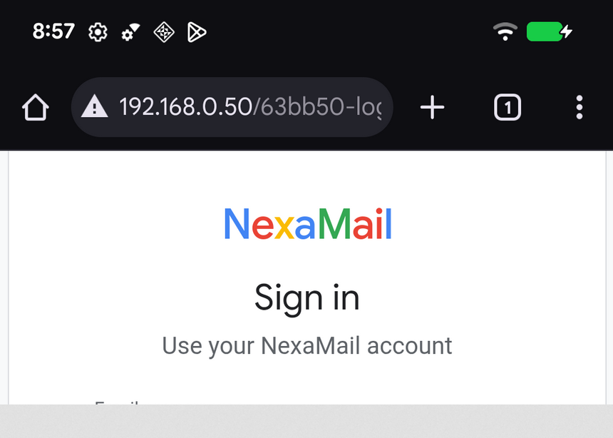
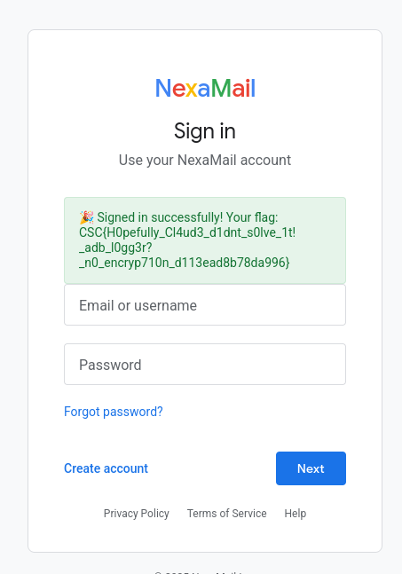

# WireTap

## Category
Forensics

## Estimated difficulty
Medium

## Description
A PCAP file which captured USB traffic. This USB traffic has been generated by an ADB (Android Debug Bridge) communication.
The contestant can solve the challenge by:
1. Extracting the transferred screenshot from the capture to correctly identify the website endpoint
2. Find the credentials (username/password) used to connect to the website
Once authentified, the flag is displayed.

## Scenario
During a physical security audit at NexaMail HQ, a suspicious USB device was recovered from one of the workstations. It had been plugged in without anyone's knowledge.
On the workstation itself, forensics found a packet capture that had been running at the time the device was connected.

We don't know what the device was targeting or how long it had been there. Analyse the capture and determine whether any sensitive data was leaked.

## Write-up
The contestant is provided with a website (which only displays a 404) and a Wireshark network capture. Opening it, instantly yields USB captured data. There's plenty of online tools to parse such captures for keyboards, mouses, headsets, printers, etc... However, this capture is a bit different. Most of the online parsers will not work.

### Reconnaissance
The most interesting packets to discover which device is being used are the `GET DESCRIPTOR` packets and most specifically, the `Response DEVICE` one. We can for example quickly get this information:
- `idVendor`: Google Inc.
- `idProduct`: Nexus/Pixel Device (charging + debug)

Now, we know that we are looking at a USB connection made with a mobile device in the "Debug" mode which simply refers to the Android Debug Bridge.

### Further analysis
A simple string search (or just `strings`) will already yield some information such as:
- A fake flag: `CSC{d1d_y0u_us3_Cl4ud3_t0_f1nd_m3?_k33p_l00k1ng!_f3225309987939a9}` (Made to trigger AI agents)
- A lot of 4 characters strings such as `OPEN`, `WRTE`, `OKAY`, ...
- We also see: `shell,v2,TERM=xterm-256color,raw:screencap /sdcard/screen.png` which indicates that a screenshot has been taken on the device
- And finally, we see the combination of `RECV` followed by `/sdcard/screen.png`

The next logical step is therefore to analyse the screenshot that was taken.

### Screenshot
With a bit of research, we can quickly find some really interesting documentation about the [ADB internals](https://www.synacktiv.com/publications/diving-into-adb-protocol-internals-12) wich allows use to understand that the keyword `RECV` is made whenever we want to download a file from the device to the client. Therefore, this file must exist in the capture!

If you look at the biggest packet of the capture, you will find packet number 1011 which contains the start of the PNG header. By extracting this file and writing it to disk with the method you prefer (ie. Python):
```py
from scapy.all import rdpcap
packets = rdpcap("capture.pcapng")
p = packets[1010].load[27:]
with open("screenshot.png", "wb") as f:
	f.write(p)
```
We can find a beautiful (partially corrupted) screenshot of the user screen (NOTE: We don't get the full screenshot because, _I assume_, a temporary connection is getting opened to transfer the file).



Unfortunately, we cannot see the username nor the password nor the flag on the screenshot. However, one piece of information is really important in the screenshot and that is the endpoint of the login form: `/63bb50-login` (we cannot see the whole URL, however, the contestant is supposed to understand that `/63bb50-lo` is incomplete and that it must be `/63bb50-login`)

*(This is also one of the design choice that was made to prevent LLMs from solving the challenge on its own)*

### Credentials
If we go on the identified endpoint, we are prompted with a login page. The goal now is to get the credentials of the user who logged in. To do so, we need to go back in the Wireshark capture.
Do you remember the keyword that we saw ? `OPEN`, `WRTE`, `OKAY`, ...
- `WRTE` is used to send data to a recipient
- `OKAY` is a type of acknowledgment
- `OPEN` just opened the connection (if you look at the end you should find `CLSE`)

By wandering inside the file, we can start to see that sometimes the host is sending some letters and the the device is also sending some letters always following a `WRTE` statement. The logic wants that; as the host who types on the keyboard, whatever I'm writing is sent to the mobile device and the mobile device sends it back to me so that my host displays it on the command line.

We can thus have a really easy approach:
1. Keep only communication Host -> Device (or opposite) - Otherwise, we will have duplicate information (It answers "To whom this specific packet is going ? Could be a OKAY")
2. Keep only `URB_BULK out` packets - Mainly for the same reason as the other one (It answers "Who is receiving information ?")
3. Keep only packets that does not contain `WRTE` or `OKAY` - Otherwise, it is only metadata. We want to only keep packets with actual data

Doing this for an identified arbitrary range yields the credentials: (The range can be identified manually)
```py
from scapy.all import rdpcap

packets = rdpcap("capture.pcapng")

def parse_packet(packets, start, end):
	command = ""
	for p in packets[start:end]:
		p = p.load
		if p[16] != 0:
			continue # If 0 then communication from Host -> Mobile device
		if p[21] != 1:
			continue # If 1 then URB_BULK OUT
		if b"WRTE" in p or b"OKAY" in p:
			continue # Protocol messages
		command += p[32:].decode()
	command = command.strip()
	return command.split()[-1].replace('"', '')

# Get packet range 125 -> 358 (Username)
username = parse_packet(packets, 125, 358)

# Get packet range 359 -> 877 (Password)
password = parse_packet(packets, 359, 877)

print(f"{username}:{password}")
```

### Getting the flag
We now have all the pieces of information to login inside the website!



## Flag
`CSC{H0pefully_Cl4ud3_d1dnt_s0lve_1t!_adb_l0gg3r?_n0_encryp710n_d113ead8b78da996}`

## Creator
Maximilien Laenen

## Creator bio
Former CSCBE participant, mainly interested in mobile applications and reverse engineering. I hope you will ~~hate~~ like my challenges! 👀
