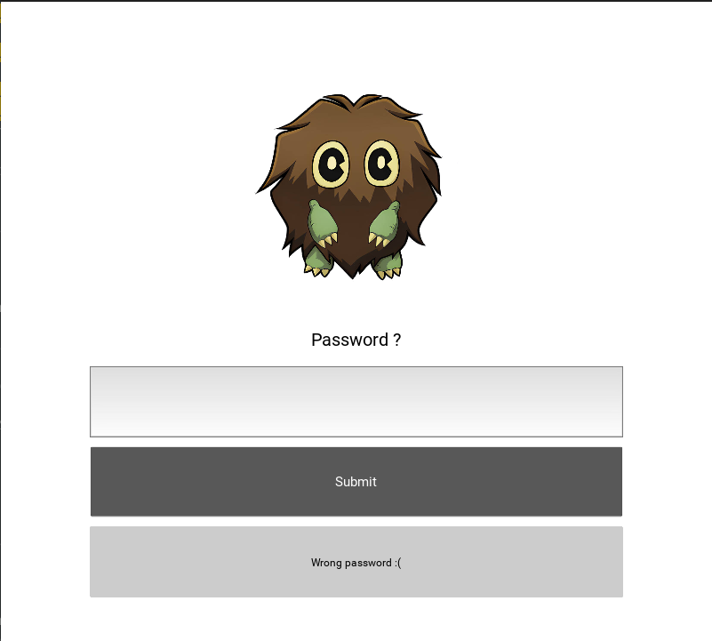

# Kuriboh

## Category
Mobile

## Estimated difficulty
Easy

## Description
A kivy app that performs a simple xor on the user's input. The contestant can solve the challenge by reverse engineering the python bytecode and understand the app logic.

## Scenario
Yugi decided to improve his skills and digitized all of his playing cards into a mobile application. He invites you to play a game to try and beat each of the monsters he has prepared for you. Are you ready for the first battle ?

## Write-up
The app is compiled for every architecture so the contestant can install it on an emulator or on a physical device. When launching the app, the user is asked for a password. If it is not correct, the message `Wrong password :(` is displayed.


Opening the APK in `jadx` does provide some interesting information such as:
- The package name: `be.x1mus.kuriboh`
- The name of the main activity: `org.kivy.android.PythonActivity`

By browsing in the code and in the resources we stumble upon an unusual file called `private.tar` inside the `assets` folder. Let's extract it to get the content of that archive.
```bash
apktool d kuriboh.apk -o kuriboh-out
cd kuriboh-out/assets
tar xvf private.tar
ls -larth
-rwxrwx--- 1 root vboxsf 324K Jul  5 04:10 private.tar
drwxrwx--- 1 root vboxsf 4.0K Jul  5 04:10 ..
-rwxrwx--- 1 root vboxsf  811 Jul  5 04:11 kuriboh.kv
-rwxrwx--- 1 root vboxsf  435 Jul  5 04:11 sitecustomize.pyc
-rwxrwx--- 1 root vboxsf   86 Jul  5 04:11 p4a_env_vars.txt
-rwxrwx--- 1 root vboxsf 2.3K Jul  5 04:11 main.pyc
-rwxrwx--- 1 root vboxsf 325K Jul  5 04:11 kuriboh.png
drwxrwx--- 1 root vboxsf 4.0K Jul  5 04:11 .
```

The most important file is the `main.pyc` file. However we cannot display it directly because it is a python bytecode file:
```bash
file main.pyc 
main.pyc: Byte-compiled Python module for CPython 3.11, timestamp-based, .py timestamp: Sat Apr 13 14:11:08 2024 UTC, .py size: 944 bytes
```

Doing some google research, we quickly find a Python bytecode decompiler supporting Python 3.11 called [pycdc](https://github.com/zrax/pycdc). Using this tool allows us to get a near perfect python code.
```py
# Source Generated with Decompyle++
# File: main.pyc (Python 3.11)

from kivy.app import App
from kivy.uix.gridlayout import GridLayout
from kivy.properties import ObjectProperty

class ActivityLayout(GridLayout):
    password = ObjectProperty(None)
    result = ObjectProperty(None)
    
    def submit(self):
        flag = self.password.text
        if Kuriboh().check(flag):
            self.result.text = "Good job! Here's your flag:\nCSC{" + flag + '}'
        else:
            self.result.text = 'Wrong password :('
        self.password.text = ''


class Kuriboh(App):
    encoded = [139, 149, 146, 209, 130, 208, 136, 191, 209, 213, 191, 150, 211, 146, 153, 191, 131, 149, 148, 211, 193, 193, 193, 191, 209, 130, 217, 132, 129, 217, 131, 134, 215, 132, 213, 130, 215, 134, 209, 133]
    
    def build(self):
        return ActivityLayout()

    
    def check(self, message):
Warning: block stack is not empty!
        if len(message) != len(self.encoded):
            return False
        for a, b in None(self.encoded, message):
            if a ^ ord(b) != 224:
                return False
            return True


if __name__ == '__main__':
    Kuriboh().run()
    return None
```

Even with a few errors present in the decompilation, we can easily understand that the application is XORing the user input with a hardcoded integer list. Each integer is xored with each character of the input and it must be equal to 224. Therefore we just have to XOR each element of the list with 224 to get the password.
```py
encoded = [139, 149, 146, 209, 130, 208, 136, 191, 209, 213, 191, 150, 211, 146, 153, 191, 131, 149, 148, 211, 193, 193, 193, 191, 209, 130, 217, 132, 129, 217, 131, 134, 215, 132, 213, 130, 215, 134, 209, 133]
print("".join([chr(x^224) for x in encoded]))
# output: kur1b0h_15_v3ry_cut3!!!_1b9da9cf7d5b7f1e
```

Just wrap the output with the flag format or input it in the app to verify it.

## Flag
`CSC{kur1b0h_15_v3ry_cut3!!!_1b9da9cf7d5b7f1e}`

## Creator
Maximilien Laenen

## Creator bio
Former CSCBE participant, mainly interested in mobile applications and reverse engineering. I hope you will ~~hate~~ like my challenges! 👀
