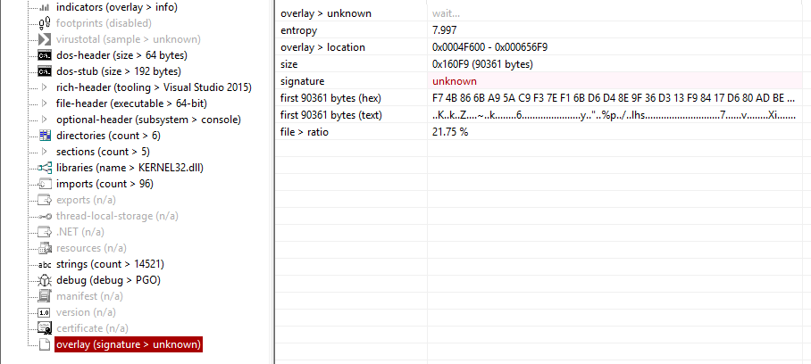
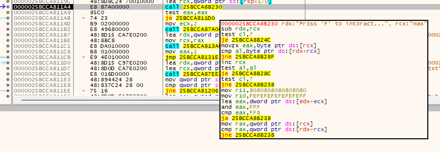

# Out of Sight

## Category
Reverse

## Estimated difficulty
Medium

## Description
A packed windows executable mimicking a ransomware behavior. The goal is to reverse the executable to decrypt the encryted `flag.txt`. The packing is performed manually (not using common packers such as UPX) and the packed part is put in the file overlay using a combination of compression and xor.

## Scenario
*"I swear it was just a normal executable..."*

## Write-up
The contestant is provided with 2 files: a windows executable `out-of-sight.exe` and what appears to be an unintelligible text file containing the flag `flag.txt`.

### Reconnaissance
This first step to perform when facing unknown files is throwing the `file` command on them:
```bash
┌──(kali㉿kali)-[~]
└─$ file out-of-sight.exe
out-of-sight.exe: PE32+ executable for MS Windows 6.00 (console), x86-64, 5 sections
┌──(kali㉿kali)-[~]
└─$ file flag.txt
flag.txt: data
```

This, however, doesn't provide a lot more information expect that it is a 64-bit executable... Let's try to launch the executable (on any platform you want. I will be using `Wine`).
```bash
┌──(kali㉿kali)-[~/Desktop]
└─$ wine out-of-sight.exe
Please send 1 BTC to this address to retrieve the decryption password: 1A1zP1eP5QGefi2DMPTfTL5SLmv7DivfNa

Decryption password: password
Incorrect password.
```

It is very clear now what the challenge is about. We need to reverse engineer the ransomware in order to get the decryption password for the encrypted flag.

Finally, we can get way more information about PE files with tools such as PEStudio, Detect It Easy, VirusTotal, etc. Here's the most important part of the PEStudio results.



PEStudio nicely flags the overlay tab for us. An *overlay* in Windows executable, is basically appended data to the executable. It is sometimes used to store additionnal information (such as in archive for setups, metadata, etc.). For our ransomware, it is used as an obfuscation technique.

Other useful information in this tab might be:
- Entropy: 7.997 which indicates that this part of the executable is highly random. Meaning probably encrypted, compressed, or else.
- Signature: Unknown which indicates that PEStudio can't match this with any known file format.

### Digging deeper
One possible approach is to load the binary into Ghidra for static analysis. But understanding the decompiled code quickly, can be difficult. A smarter move is to switch to dynamic analysis: if the executable decompresses or decrypts that high-entropy region at runtime, then the unpacked payload must exist in memory at some point. By running the program under a debugger after the unpacking routine executes, we can recover the reconstructed content directly and even walk through instructions one at a time letting the binary do the hard work for us.

Here, 2 main solutions come up: dumping memory to then do again static analysis or just step through each instructions while running to find the password comparison. This writeup will use the second approach.

One of the best tool to perform dynamic analysis of a Windows executable is `x64dbg` (or `x32dbg`). It will allow you to step through the program instruction by instruction, inspect memory, inspect register, modify execution flow, ...

By simply opening our file, we can let it run until it hits the password prompting. After which it is easy to find the comparison of the strings:


We can see that this function is called with the parameter *"Pr3ss 'F' t0 int3ract..."* (the real password) and *"max"* (the password I provided at runtime). We only need to provide this password to decrypt the flag!

## Flag
`CSC{p4ck1ng_0v3rl4ys_1s_s0_much_fun_1e743f6d7ebe0028}`

## Creator
Maximilien Laenen

## Creator bio
Former CSCBE participant, mainly interested in mobile applications and reverse engineering. I hope you will ~~hate~~ like my challenges! 👀
